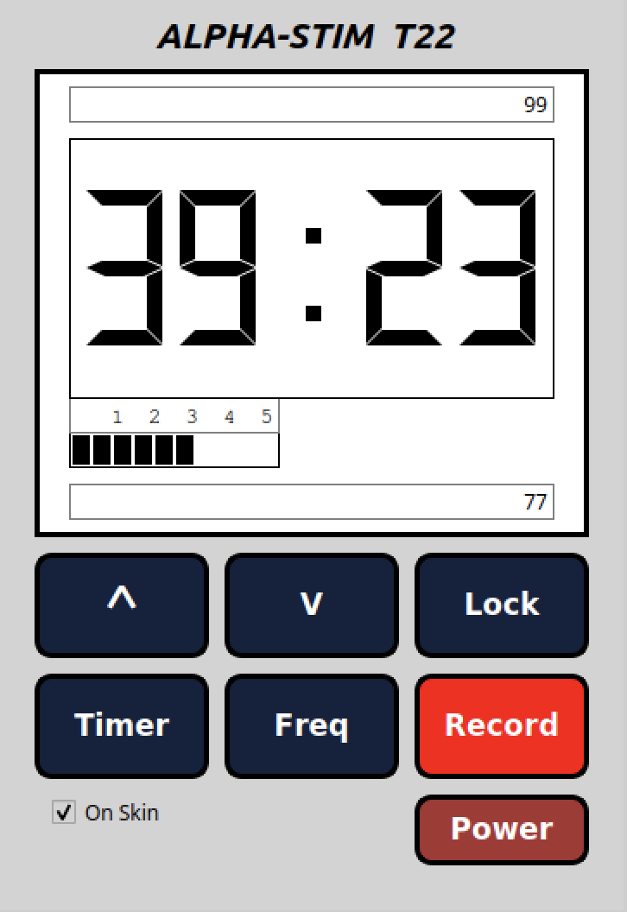

# Comp3004 F2021 Team Project - Team 22

## Developing a CES device simulator



## Authors

* Ebubechukwu Okelekwe - 101093432
* Beshara     Hajjar   - 101072483
* Nicholas    Lebel    - 101092571

### Built With

* [Qt](https://www.qt.io/)

### Deliverables

* [Deliverables File](https://docs.google.com/document/d/18zPze0UiZgJJrKsnVQPXbsGJVUNYUIRckwPa_fbBPB8/)

### Installing & Executing the CES device simulator

```- Download file from Brightspace
   - Open Qt creator
   - Go to file
   - Open project
   - Build and Run project
```


